# End-to-End Spark ETL Project: Scalable Data Processing and Cloud Integration

The aim of this project is to complete a Spark ETL project using tools such as Apache Spark, Azure cloud services, and data processing workflows. The project also emphasizes the creation and deployment of Spark jobs to process large datasets, the cleansing and transformation of data, the integration of external APIs for data enrichment, and the management of data storage in Azure cloud environments.

## Throughout the project, the following tasks will be carried out:

- **Work with Spark Jobs**: Spark jobs for Extract, Transform, and Load (ETL) processes will be created. This includes reading, transforming, and writing data efficiently.
- **Integrate with Azure Cloud**: Hands-on experience will be gained by setting up Azure cloud storage, uploading data, and interacting with Azure-based data services.
- **Data Cleansing**: Missing or incorrect data in real-world datasets, such as null values, will be handled. Data enrichment techniques will be applied to address issues in the dataset.
- **API Integration**: External APIs, such as the OpenCage Geocoding API, will be used to enrich the dataset by obtaining missing geographical data.
- **Data Storage and Performance Optimization**: Processed data will be stored in efficient formats like Parquet, with proper partitioning for optimized querying and scalability. Spark jobs will be configured to run efficiently on Azure resources, ensuring optimal use of memory and CPU cores.

## This assignment will also familiarize with essential development tools and practices, such as:

- **Terraform**: Cloud infrastructure provisioning will be automated using Terraform to set up the necessary storage accounts and compute resources for the Spark jobs.
- **Docker**: Spark jobs will be packaged and run in Docker containers to facilitate local development and testing.
- **Azure Resource Management**: The nuances of resource allocation and cost management when deploying Spark on Azure cloud platforms will be understood.

## By the end of the assignment, a fully functional Spark ETL pipeline will be developed, which:

- Processes data
- Cleanses it
- Performs geospatial transformations
- Stores the enriched data in Azure cloud storage

## Prerequisites

Before starting the project, we need to ensure that the following tools and services are set up:

- **Azure Account**: An active Azure subscription is required to provision the necessary cloud resources.
- **Terraform**: Terraform should be installed to automate the cloud infrastructure setup.
- **Docker**: Docker is needed to run the Spark job locally in a containerized environment.
- **Apache Spark**: Spark should be available locally or configured within a Docker container to test Spark jobs.
- **IDE**: An Integrated Development Environment (IDE) such as IntelliJ IDEA or Visual Studio Code is recommended for writing and testing code.

## Setup Instructions

### 1. Clone the Repository

The repository should first be forked to our GitLab account. Then, it can be cloned to our local machine using the following command:

```bash
git clone git@git.epam.com:abdullah_duman/m06_sparkbasics_python_azure.git
cd m06_sparkbasics_python_azure
```

### 2. Initialize Terraform

To set up the necessary cloud resources (storage account, compute resources), Terraform should be initialized and applied. First, we need to ensure that our Terraform configuration files are properly set up.

In the root directory of the project, the following command should be run to initialize Terraform:

 ```bash
terraform init
```
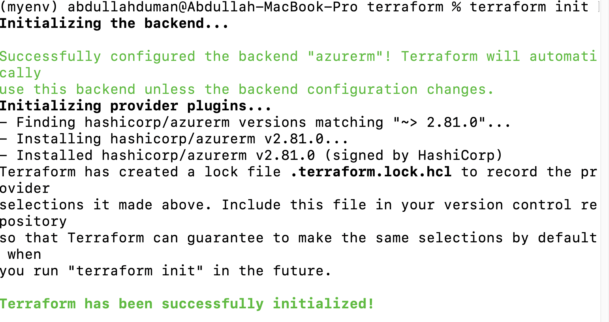

This command sets up the Terraform working directory and ensures that the necessary provider plugins for Azure are downloaded. It should be confirmed that Terraform configuration files (main.tf, variables.tf, etc.) are correctly set for Azure.

### 3. Create a Terraform Plan

After initialization, a Terraform plan can be created to preview the changes that will be made:

```bash
terraform plan -out=terraform.plan
````
This command generates an execution plan, which is saved to a file named terraform.plan. This file provides a preview of the resources that will be created or modified.

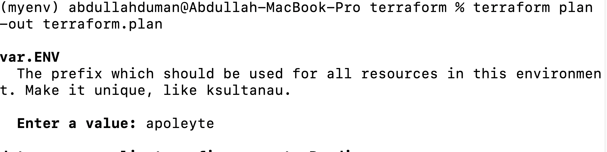

### 4. Apply the Terraform Plan

Once the plan has been reviewed, it can be applied to provision the specified resources:

```bash
terraform apply terraform.plan
````

The saved plan will be used to create the resources as defined in the configuration.

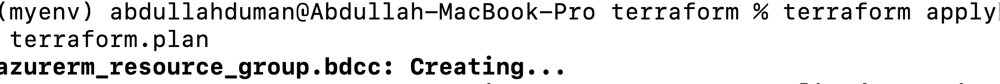

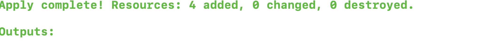

Upon successful application, an Azure Resource Group and Kubernetes Service, storage account, container registry connected to this resource group will be provisioned according to the Terraform configuration.

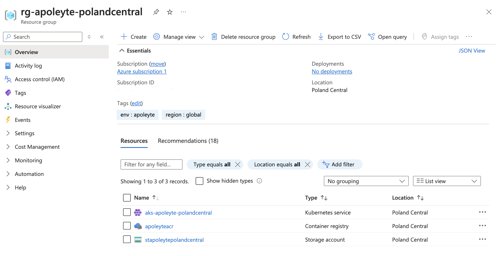

### 5. Upload Folder to Azure Storage

Once the Terraform resources have been successfully provisioned, the folder can be uploaded to the Azure storage container created in the previous steps.

The Azure Storage Explorer or the Azure CLI can be used for the upload. The storage container created in Terraform is named `sparkbasics`, and the storage account is `stapoleytepolandcentral`.

To upload the folder, the following steps should be followed:

1. **Azure Storage Explorer** should be opened to connect to the storage account.
2. The `stapoleytepolandcentral` storage account should be navigated to, and then the `sparkbasics` container should be opened.
3. The desired folder from the local machine should be uploaded to the container.

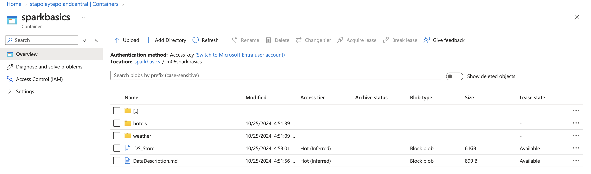

### 6. Read Data from Storage Container

In this section, data is read from an Azure Storage container using Apache Spark. The data, stored in CSV and Parquet files in Azure Data Lake, is handled by reading compressed files and partitioned datasets.

#### Code Explanation

1. **CSV Files (Hotels Data)**
    - The hotels data, stored in CSV format within the Azure Storage container, is read using the `.option("compression", "gzip")` method to handle files compressed in gzip format.
    - The path `hotels/*.csv.gz` in the `sparkbasics` container is used to load the data.

2. **Parquet Files (Weather Data)**
    - The weather data, stored in Parquet format in the `sparkbasics` container, is read using the `.parquet()` method.

#### Key Steps:

- **Process Hotels Data**: The CSV files compressed with gzip from the `hotels` folder are loaded. Null values in the Latitude and Longitude columns are checked and counted.

    ```python
    df_hotels = spark.read.format("csv") \
        .option("header", "true") \
        .option("compression", "gzip") \
        .load(f"{storage_uri}hotels/*.csv.gz")
    ```

    After loading the data, the number of hotels with missing coordinates is displayed:

    ```python
    null_locations = df_hotels.filter(df_hotels.Latitude.isNull() | df_hotels.Longitude.isNull())
    print(f"Number of hotels with null coordinates: {null_locations.count()}")
    ```

- **Load Weather Data**: The Parquet weather data from a partitioned directory structure is loaded into the Spark DataFrame.

    ```python
    weather_data_path = f"abfss://sparkbasics@{storage_account_name}.dfs.core.windows.net/m06sparkbasics/weather/year=*/month=*/day=*/*.parquet"
    df_weather = spark.read.parquet(weather_data_path)
    ```

This process demonstrates how to read both CSV and Parquet data from an Azure Storage container, handle compressed files, and process partitioned datasets using Apache Spark.

### 7. Handle Incorrect (Null) Values in Latitude & Longitude for Hotels

In this section, we process the hotels data to handle missing or incorrect values for latitude and longitude coordinates. If any missing values are found, we use the OpenCage Geocoding API to fetch the correct coordinates dynamically via a REST API call.

#### Code Explanation

1. **Fetching Coordinates from OpenCage API**
    - For each hotel with missing latitude and longitude, we send a request to the OpenCage Geocoding API using the city and address of the hotel. The API returns the correct latitude and longitude values if available.

    ```python
    def get_coordinates(city, address, api_key):
        """Fetches latitude and longitude coordinates using the OpenCage API."""
        url = f"https://api.opencagedata.com/geocode/v1/json?q={address}, {city}&key={api_key}"
        response = requests.get(url)
        data = response.json()
        
        if data['results']:
            latitude = data['results'][0]['geometry']['lat']
            longitude = data['results'][0]['geometry']['lng']
            return latitude, longitude
        return None, None
    ```

2. **Processing Hotels Data**
    - We read the hotels data stored in CSV files, check for rows where latitude and longitude are missing, and for each such row, we fetch the correct coordinates using the `get_coordinates` function.

    ```python
    def process_hotels(spark, api_key, storage_uri):
        """Process hotels DataFrame to update coordinates."""
        df_hotels = spark.read.format("csv") \
            .option("header", "true") \
            .option("compression", "gzip") \
            .load(f"{storage_uri}m06sparkbasics/hotels/*.csv.gz")
        
        # Check for null values in Latitude and Longitude
        null_locations = df_hotels.filter(df_hotels.Latitude.isNull() | df_hotels.Longitude.isNull())
        print(f"Number of hotels with null coordinates: {null_locations.count()}")
        
        # Update missing coordinates by fetching them via OpenCage API
        updated_rows = []
        for row in null_locations.collect():
            latitude, longitude = get_coordinates(row.City, row.Address, api_key)
            updated_row = row.asDict()
            updated_row['Latitude'] = latitude if latitude is not None else row.Latitude
            updated_row['Longitude'] = longitude if longitude is not None else row.Longitude
            updated_rows.append(Row(**updated_row))
            print(f"Updated row: {updated_row}")  # Log updated rows

        # Create DataFrame with updated rows
        updated_df = spark.createDataFrame(updated_rows) \
                          .withColumnRenamed("Latitude", "Updated_Latitude") \
                          .withColumnRenamed("Longitude", "Updated_Longitude")
        
        # Join the updated coordinates back to the original DataFrame
        df_hotels = df_hotels.join(updated_df.select("Id", "Updated_Latitude", "Updated_Longitude"), "Id", "left_outer") \
            .withColumn("Latitude", when(col("Latitude").isNotNull(), col("Latitude")).otherwise(col("Updated_Latitude"))) \
            .withColumn("Longitude", when(col("Longitude").isNotNull(), col("Longitude")).otherwise(col("Updated_Longitude"))) \
            .drop("Updated_Latitude", "Updated_Longitude")

        return df_hotels
    ```

3. **Generate Geohash for Hotels**
    - After updating the coordinates, we generate a geohash for each hotel using its latitude and longitude to identify its location with a precision of 4 characters.

    ```python
    def generate_geohash(lat, lon):
        """Generate a 4-character geohash from latitude and longitude."""
        if lat is not None and lon is not None:
            return geohash2.encode(lat, lon, precision=4)
        return None
    ```

4. **Integrating the Process**
    - We integrate the steps by creating a Spark session, processing the hotels data to handle missing coordinates, and generating geohashes for each hotel.

    ```python
    def main():
        # Initialize Spark session and retrieve storage URI
        spark = create_spark_session()
        storage_uri = get_storage_uri()
        
        # Process the hotels data
        df_hotels = process_hotels(spark, api_key, storage_uri)

        # Add geohash column
        geohash_udf = udf(generate_geohash, StringType())
        df_hotels_with_geohash = df_hotels.withColumn("Geohash", geohash_udf(df_hotels["Latitude"].cast("float"), df_hotels["Longitude"].cast("float")))

        # Show the DataFrame with geohash
        print("Hotels DataFrame with Geohash:")
        df_hotels_with_geohash.show(truncate=False)
    ```

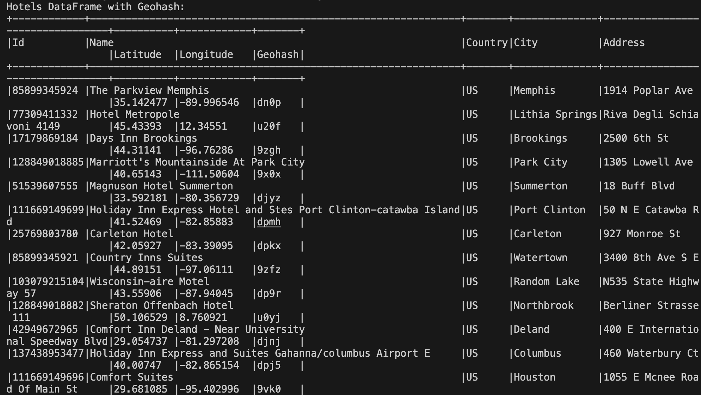

#### Key Points:
- **Missing Latitude & Longitude Handling**: Missing or incorrect latitude and longitude values are updated by querying the OpenCage Geocoding API for the correct coordinates.
- **Geohash Generation**: A geohash is generated for each hotel using the updated latitude and longitude to enable geospatial analysis.
- **Real-time Processing**: The coordinates are updated on the fly for hotels with missing values during the Spark job execution.

This process ensures that even if some hotels have missing geographical data, their coordinates are dynamically fetched and processed without interrupting the workflow.

## 8. Geohash Generation from Latitude & Longitude

In this section, we will use the `geohash2` Python library to generate a 4-character geohash from latitude and longitude coordinates. Geohashing is a method for encoding latitude and longitude into a compact string, which can be used for various applications, such as spatial indexing and geospatial data clustering.

### Steps:
1. **Add a New Column for Geohash**: We define a User Defined Function (UDF) called `generate_geohash` that accepts latitude and longitude as input and returns a 4-character geohash.
2. **Apply the UDF to Generate Geohash**: The UDF is then applied to the `Latitude` and `Longitude` columns of the hotels and weather DataFrames, generating a new `Geohash` column in both DataFrames.
3. **Example Output**: The generated geohash is a compact representation of the location, which can be used for efficient geospatial queries.

### Code Explanation

- **generate_geohash Function**:
    - Takes `lat` and `lon` as inputs.
    - Uses the `geohash2.encode` method to encode these coordinates into a 4-character geohash.
    - If either `lat` or `lon` is `None`, it returns `None` for the geohash.

- **UDF Registration**: 
    - A User Defined Function (UDF) is registered to apply the `generate_geohash` function across rows in the DataFrame.

    ```python
    def generate_geohash(lat, lon):
        """Generate a 4-character geohash from latitude and longitude."""
        if lat is not None and lon is not None:
            return geohash2.encode(lat, lon, precision=4)
        return None
    ```

- **Applying the UDF**:
    - The UDF is applied to both the `df_hotels` and `df_weather` DataFrames to create the new `Geohash` column.

    ```python
    geohash_udf = udf(generate_geohash, StringType())
    df_hotels_with_geohash = df_hotels.withColumn("Geohash", geohash_udf(df_hotels["Latitude"].cast("float"), df_hotels["Longitude"].cast("float")))
    ```

    This adds the `Geohash` column to the hotels DataFrame and outputs the updated DataFrame with geohashes.

### Expected Output

- For each hotel and weather record, the script generates a `Geohash` that represents the geographical location of the hotel or weather data point.

- The generated geohash is now available for use in spatial analysis, allowing for efficient joins based on geographical proximity.

### Use Case

- **Weather and Hotel Data Merge**: By adding the `Geohash` column to both the weather and hotel DataFrames, we can perform spatial joins to match weather data with hotels based on proximity. This is useful for analysis that combines geospatial data from multiple sources.

---

### Next Steps:
- Once the `Geohash` column is added to both DataFrames, a left join is performed on the `Geohash` field to combine the data based on the location. This allows for weather data to be associated with nearby hotels efficiently.

## 9. Left Join Weather and Hotels Data by Generated 4-Character Geohash

In this step, a **left join** will be performed between the weather and hotels data using the generated 4-character geohash. The goal is to match each hotel with the corresponding weather data for its location without duplicating records and ensuring that the job is idempotent.

### Steps

1. **Generate Geohash for Hotels and Weather Data**:
   Both datasets (hotels and weather) will be enriched with a new column containing a **4-character geohash** generated from the latitude and longitude values. This geohash will act as a unique identifier for the location.

2. **Perform Left Join**:
   The `left join` operation will ensure that all records from the hotels dataset are retained, and the matching weather data will be appended to each hotel record based on the generated geohash. Any hotels that do not have a corresponding weather record will have `null` values for the weather-related columns.

3. **Avoid Data Duplication**:
   The left join operation will ensure that data is merged based on the geohash and avoid duplication of hotel records. Each hotel will only appear once, even if multiple weather stations exist within the same geohash.

4. **Idempotent Job**:
   By performing the join based on the geohash column, the process will ensure idempotency. Running the job multiple times will not cause duplicates or changes in the result, as the geohash uniquely identifies each location.

### Code Implementation

Here is how the left join can be implemented:

```python
# Perform the left join with the hotels DataFrame using the geohash
df_joined = df_hotels_with_geohash.join(df_weather_with_geohash, on="Geohash", how="left")

# Show the first few rows of the joined DataFrame
df_joined.show(truncate=False)
```

### Explanation

- `df_hotels_with_geohash`: The hotels DataFrame with the generated geohash column.
- `df_weather_with_geohash`: The weather DataFrame with the generated geohash column.
- `join(on="Geohash", how="left")`: The left join will be performed on the Geohash column. This means all rows from the hotels DataFrame will be retained, and the corresponding weather data from the weather DataFrame will be added based on the geohash.
- `df_joined.show(truncate=False)`: The first few rows of the joined DataFrame will be displayed to verify the results.

### Result

The resulting DataFrame (`df_joined`) will contain all the original hotel data along with the matched weather data. If no corresponding weather entry is found, `null` values will be present in the weather columns, ensuring that no data from the hotels dataset is lost.

### Benefits

- **Data Integrity**: It will be ensured that no hotel records are lost or duplicated in the final result.
- **Efficiency**: The use of geohashes for spatial joining will make the process efficient, as the complexity of matching locations is reduced.
- **Idempotency**: Running the job multiple times will produce the same result without duplication, ensuring the process is stable and repeatable.

### Output after Left Join

After performing the join, the output may look like the following:


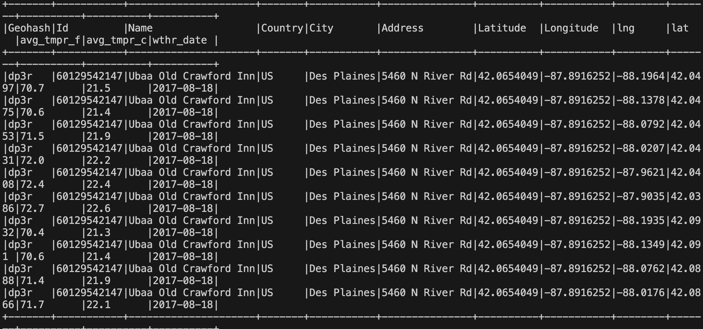

## 10. Store Enriched Data in Provisioned Storage Account

Once the data has been successfully joined, the next step is to store the enriched data in an Azure Storage Account. This ensures that the processed data is available for further analysis, reporting, or downstream consumption. The enriched data will be saved in Parquet format, which is highly efficient for storage and processing.

### Steps

1. **Provision Storage Account and Container**: Using Terraform, a Storage Account will be provisioned in Azure, and a container named `data` will be created. This container will store the enriched data in a structured format. The data container is configured with the `prevent_destroy = true` setting in Terraform to ensure that the data persists even when the infrastructure is destroyed.

2. **Ensure Data Partitioning**: The data will be partitioned based on the `wthr_date` column. This will optimize data retrieval for date-based filtering and reduce scan times when querying specific periods.

3. **Store in Parquet Format**: The enriched data will be stored in Parquet format to leverage its columnar storage benefits, including:
   - Efficient storage and compression.
   - Faster query performance due to columnar format.
   - Support for schema evolution.

4. **Terraform Configuration**: Terraform will be used to configure the storage resources and ensure the data container is provisioned correctly. This includes setting up access policies and ensuring that the container is protected with `prevent_destroy`.

5. **Data Upload**: After the enriched data is processed, it will be uploaded to the storage account in the following format:

   ```bash
   abfss://data@<storage_account_name>.dfs.core.windows.net/enriched_data/
   ``` 

### Code Implementation

Here’s an example of how to store the enriched data in Azure Storage Account using Python and Spark:

```python
# Define the path where the data will be stored
output_path = "abfss://data@<storage_account_name>.dfs.core.windows.net/enriched_data/"

# Write the joined DataFrame in Parquet format with partitioning by 'wthr_date'
df_joined.write \
    .partitionBy("wthr_date") \
    .parquet(output_path)

print("Enriched data successfully stored in the storage account.")
```
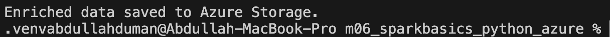
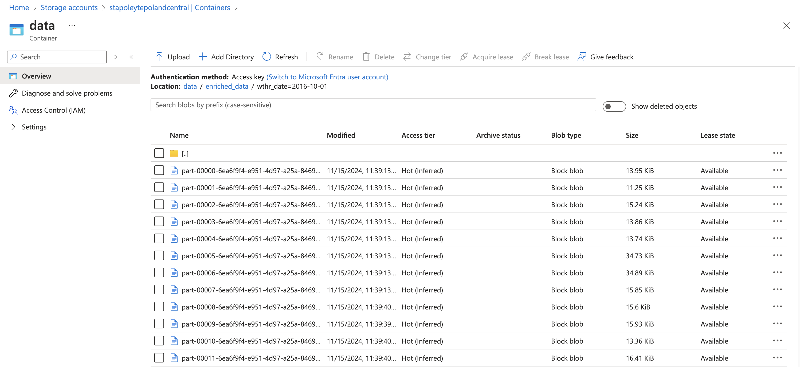

## 11. Test for Spark Application

This project contains tests for the Spark-based application, specifically focused on validating key functions such as creating a Spark session, processing hotel data, generating geohashes, and interacting with Azure Storage.

## Prerequisites

Following packages should be installed before testing:

- `pyspark`
- `unittest`
- `mock` (for mocking external dependencies)

### Tests

- **`test_get_coordinates_valid`**:

    ```python
    @patch('app.get_coordinates')
    def test_get_coordinates_valid(self, mock_get_coordinates):
        # Mock the response
        mock_get_coordinates.return_value = (51.5034, -0.1276)
        
        city = "London"
        address = "10 Downing St"
        latitude, longitude = mock_get_coordinates(city, address, self.api_key)  # Pass API key
        self.assertIsNotNone(latitude)
        self.assertIsNotNone(longitude)
    ```
   It is checked whether the `get_coordinates` function correctly returns valid latitude and longitude values. The response from an external service is mocked to simulate a successful coordinate lookup for the city "London" and address "10 Downing St".

- **`test_process_hotels`**:

    ```python
    def test_process_hotels(self):
        # Define test data
        data = [
            {"Id": "1", "City": "Istanbul", "Address": "Address 1", "Latitude": 41.0082, "Longitude": 28.9784},
            {"Id": "2", "City": "Ankara", "Address": "Unknown", "Latitude": None, "Longitude": None},
        ]
        
        # Create test DataFrame
        df_test_hotels = self.spark.createDataFrame(data)

        # Run process_hotels function
        processed_df = process_hotels(self.spark, self.api_key, self.storage_uri)
        
        # Check the result
        self.assertGreater(processed_df.count(), 0)
    ````
    
   It is verified whether the `process_hotels` function correctly processes hotel data and retrieves additional information. A test dataset with hotel details is used, and it is checked whether the processed DataFrame is not empty.

- **`test_generate_geohash`**:

   ```python
   def test_generate_geohash(self):
        lat = 51.5034
        lon = -0.1276
        geohash = generate_geohash(lat, lon)
        self.assertIsNotNone(geohash)
        self.assertEqual(len(geohash), 4)  # Geohash should be 4 characters long
    ```     

   It is checked whether the `generate_geohash` function returns a valid geohash for the given latitude and longitude. It is ensured that the geohash has a length of 4 characters.

### Test Output
The unittest framework will run the tests, and output will be displayed, indicating whether the tests passed or failed. The result can be seen below screenshot.

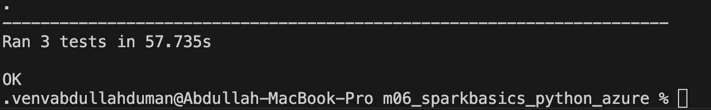

## 12. Docker Image Build and Run Instructions

### 1. Custom Spark and Hadoop Dockerfile

This Dockerfile sets up a custom Docker image for running Apache Spark with Hadoop, along with Python and the necessary dependencies for an Azure environment. The customizations in this image ensure compatibility with Spark's integration with Hadoop, as well as the necessary Azure SDKs for accessing Azure Storage and Data Lake services.

##### Customizations:

1. **Base Image**: 
    - The image is based on `openjdk:8-jdk-slim`, which provides the OpenJDK 8 environment necessary for Spark and Hadoop.

2. **Apache Spark & Hadoop Installation**:
    - Apache Spark version `3.5.3` and Hadoop version `3.3.1` are downloaded and installed. The versions can be modified by passing build arguments for `SPARK_VERSION_ARG` and `HADOOP_VERSION`.
    - The Spark and Hadoop directories are set to `/opt/spark` and `/opt/hadoop` respectively.
    - Spark is downloaded from the Apache archive and Hadoop from the official source.

3. **Azure and Hadoop Integration**:
    - Several Azure-specific JARs are added to enable Spark's integration with Azure services:
      - `hadoop-azure-${HADOOP_VERSION}.jar`
      - `hadoop-azure-datalake-${HADOOP_VERSION}.jar`
      - `azure-storage-7.0.0.jar`
      - `azure-data-lake-store-sdk-2.3.6.jar`
      - `azure-keyvault-core-1.0.0.jar`
      - `geohash-1.4.0.jar`

4. **Environment Variables**:
    - `SPARK_HOME`, `HADOOP_HOME`, and `SPARK_DIST_CLASSPATH` environment variables are configured for proper integration between Spark and Hadoop.

5. **Python Environment**:
    - Python 3 and `pip3` are installed, along with required packages: `pygeohash`, `requests`, and other dependencies from a `requirements.txt` file.
    - The `requirements.txt` file is copied and installed in the container.
    - Custom Python application files are copied into the container (`app.py` and `test.py`).

6. **Entrypoint**:
    - A custom `entrypoint.sh` script is included and set as the entry point for the container, which will be executed when the container starts.

7. **Permissions**:
    - The `entrypoint.sh` script is given execute permissions (`chmod +x`).
    - The `/opt/spark/tmp` directory is created and given full read/write/execute permissions (`chmod -R 777`).

8. **Working Directory**:
    - The working directory for the container is set to `/opt/spark/`.

9. **CMD (Execution)**:
    - By default, the container runs `python3 /opt/spark/app.py && python3 /opt/spark/test.py` using the `bash` shell.

### 2. Docker Image was Built

In this step, the Docker image was built for the project. Below are the commands and screenshots showing the process.

### Steps to Build the Docker Image:

1. **The terminal was opened** and navigated to the project directory where the `Dockerfile` is located.
2. **The Docker image was built** by running the following command:

   ```bash
   docker build -t my_project_image .
   ```

This command instructed Docker to build the image from the current directory (`.`) using the `Dockerfile` located there.

The build process was completed, and the terminal displayed output messages indicating the progress.

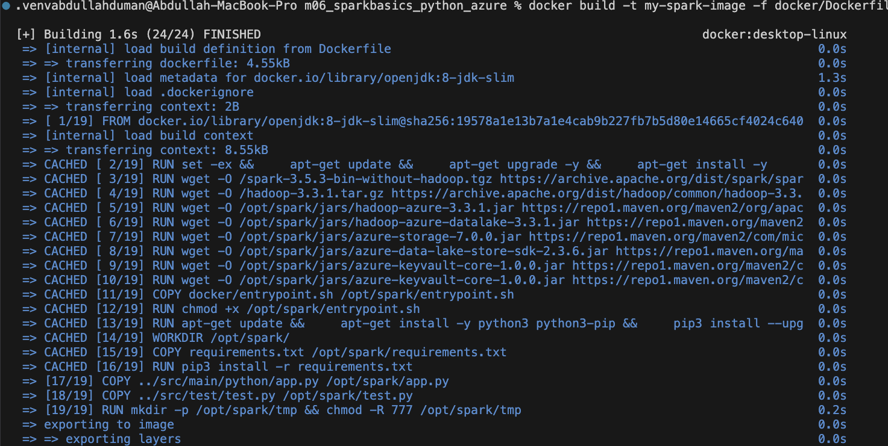

### 3. Docker Image was Run Locally

After the image was built, the Docker container was run locally to ensure everything was functioning correctly.

#### Steps to Run the Docker Image Locally:

The Docker container was run with the following command:

```bash
docker run -it --name my-spark-container my-spark-image:latest
```

The running containers were listed to check if the container was successfully started:

```bash
docker ps
```

The container should appear in the list of running containers.

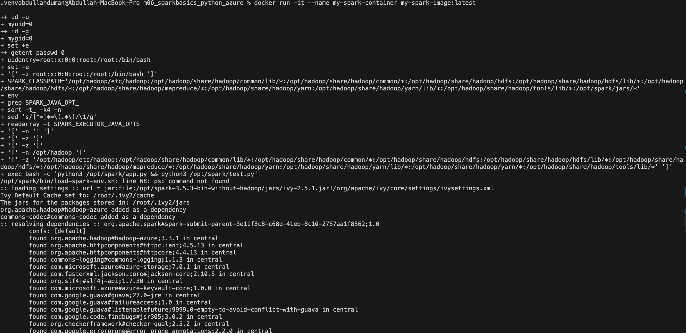

After executing the image, the output should be combined version of running both app.py and test.py thanks to this command in the app.py:

```bash
# Specify the Python files to be run
CMD ["bash", "-c", "python3 /opt/spark/app.py && python3 /opt/spark/test.py"]
```

## 13. Destroying Resources with Terraform

After the infrastructure has been tested and used, the resources created by Terraform can be cleaned up and destroyed using the `terraform destroy` command. This command is used to delete all the infrastructure resources that were provisioned during the apply process.

### Steps to Destroy the Resources:

1. **Navigate to the Directory**:
   - We need to be ensured that we are in the directory where your Terraform configuration files are located.
   
   ```bash
   main_path/terraform/
   ```
2. **Run `terraform destroy`**:

The following command should be used to destroy all the resources defined in your Terraform configuration:

```bash
terraform destroy
```
3. **Review the Output**:

The output will be displayed as the resources are destroyed. Each resource being destroyed will be shown, and the process will be confirmed when completed.

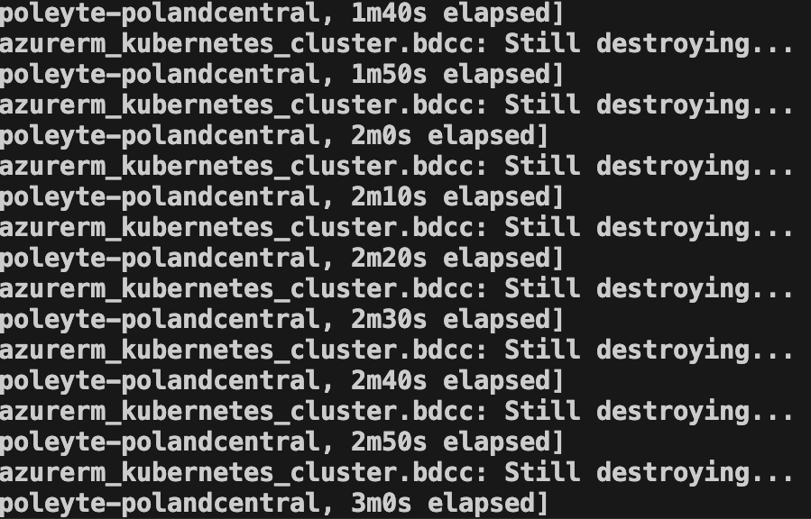


### Conclusion

A Spark ETL project was implemented using Apache Spark, Azure, Docker, and Terraform. Initially, the project was cloned, and resources such as a resource group, AKS cluster, and ACR were created using Terraform configuration files. Data was then uploaded to Azure Blob Storage using the Azure Storage Explorer.

The project processed hotel data by enriching missing latitude and longitude information through the OpenCage API. Geohashes were generated for both hotel and weather data, and a left join was performed to combine the datasets. The enriched data was then saved to Azure Storage in Parquet format.

Unit tests were created to validate key functions such as coordinate retrieval, hotel data processing, and geohash generation. A Docker image was built and executed to containerize the application. Finally, Terraform was used to destroy the resources after the completion of the project.

This process showcased the efficient use of Spark for large-scale data processing, Azure for cloud resource management, and Docker for containerization, all orchestrated through Terraform for streamlined deployment and management.


